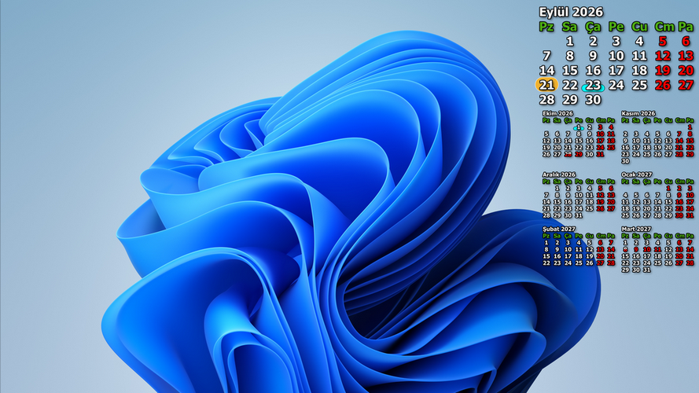
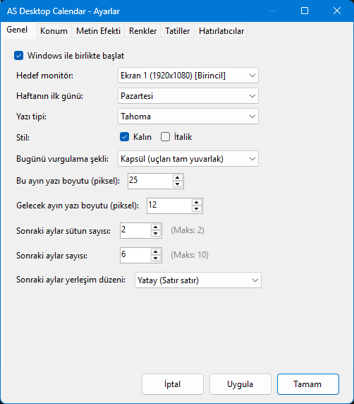
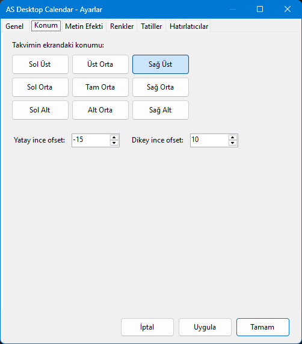
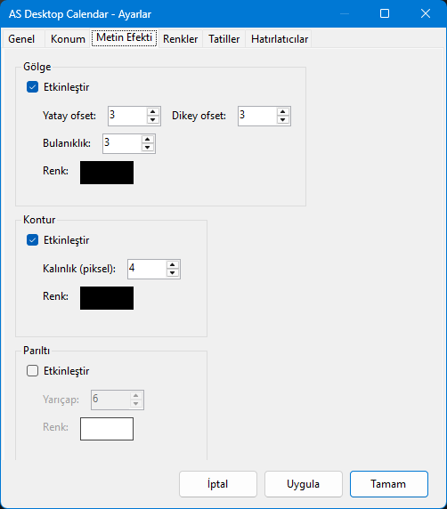
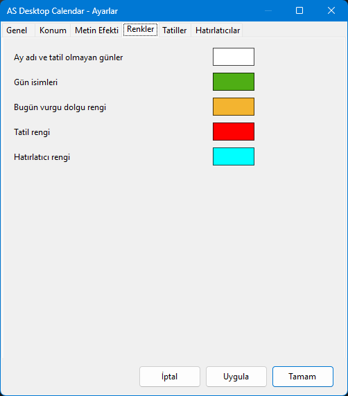
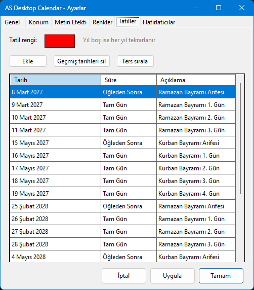
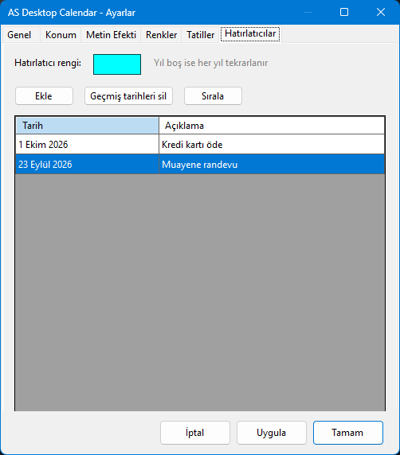

# AS Desktop Calendar

Masaüstünüzdeki duvar kağıdının üzerine güncel takvimi yerleştiren, sade ve
kişiselleştirilebilir bir Windows uygulaması.

Takvim, masaüstünü kaplayan ayrı bir pencere açmadan doğrudan duvar kağıdınızın
üzerinde görünür. Uygulama sistem tepsisinde çalışır; ayarlarınızı bir kez
yaptıktan sonra takvimi güncel tutar.



## Projenin Kökeni

Bu proje, [mesutakcan/Desktop-Calendar](https://github.com/mesutakcan/Desktop-Calendar)
adresindeki VB6 kaynak kodunun C# diline çevrilmesi ve üzerine önemli ölçüde
geliştirme yapılmasıyla ortaya çıktı. Orijinal uygulama, masaüstü duvar
kağıdının üzerine güncel ay ile gelecek ayın takvimini çizip yeniden duvar
kağıdı olarak ayarlayan, çalıştıktan sonra kapanan küçük bir araçtı.

AS Desktop Calendar aynı temel fikri korurken daha kapsamlı özellikler ve
kişiselleştirme seçenekleriyle geliştirildi.

## Öne Çıkan Özellikler

- Güncel ayı ve seçtiğiniz sayıda gelecek ayı duvar kağıdında gösterme
- Gelecek ayları birden fazla sütuna yerleştirme; yatay (satır satır) veya dikey (sütun sütun) düzeni seçme
- Birden fazla monitör arasından takvimin görüneceği ekranı seçme; çoklu monitör desteği (bkz. [Bilinen Sınırlamalar](#bilinen-sınırlamalar))
- Takvim konumunu 9 farklı hizalama seçeneğiyle belirleme (sol/orta/sağ × üst/orta/alt)
- Yatay ve dikey ince ofset ayarıyla konum hassaslaştırma
- Yazı tipi, boyutu, rengi, kalınlığı ve italik görünümü özelleştirme
- Bugünü daire, elips, dikdörtgen, yuvarlatılmış dikdörtgen veya kapsül şekliyle vurgulama
- Gölge, kontur ve parıltı efektlerini birbirinden bağımsız etkinleştirme ve özelleştirme
- Haftanın ilk gününü pazartesi veya pazar olarak seçme
- Tatilleri ve kişisel hatırlatıcıları takvim üzerinde işaretleme
- Tatillerde "Tam Gün" veya "Öğleden Sonra" (yarım gün) seçeneği; öğleden sonra tatil olan günler takvimde bölünmüş renk ile gösterilir
- Belirli bir güne ait hatırlatıcıları, gün değiştiğinde (veya uygulama açıldığında) uygulama içi bildirim penceresinde gösterme; geçmişte kalan hatırlatıcıları da ayrıca listeleme
- İsteğe bağlı olarak Windows ile birlikte otomatik başlatma
- Sistem tepsisinden takvimi yenileme, ayarları açma, GitHub deposuna gitme veya uygulamadan çıkma

## Kurulum

1. [Releases](https://github.com/mesutakcan/AS-Desktop-Calendar/releases) sayfasından
   sisteminize uygun sürümü indirin:
   - **64 bit Windows:** `AS-Desktop-Calendar-win-x64.exe`
   - **32 bit Windows:** `AS-Desktop-Calendar-win-x86.exe`
2. Dosyayı kalıcı bir klasöre kopyalayın (ör. `C:\Program Files\AS Desktop Calendar`).
   "Windows ile birlikte başlat" seçeneği uygulamanın çalıştırıldığı konumu
   kaydeder; dosyayı sonradan taşırsanız Ayarlar'dan bu seçeneği kapatıp yeniden
   açın.
3. Uygulamayı çalıştırın. Sistem tepsisinde göründüğünde takvim duvar kağıdınıza eklenir.

Sisteminizin türünü bilmiyorsanız: **Ayarlar > Sistem > Hakkında > Sistem türü**.

Uygulama çalışmıyorsa sistem tepsisindeki simgeleri genişleterek **AS Desktop
Calendar** simgesini kontrol edin.

## Kullanım

Sistem tepsisindeki uygulama simgesine sağ tıklayarak:

- **Takvimi yenile** ile duvar kağıdını hemen güncelleyebilirsiniz.
- **Ayarlar** bölümünden görünüm, konum, renk, efekt, tatil ve hatırlatıcıları düzenleyebilirsiniz.
- **Github Repo** ile projenin GitHub sayfasını açabilirsiniz.
- **Hakkında** ile uygulama sürümünü ve geliştirici bilgilerini görebilirsiniz.
- **Çıkış** ile uygulamayı kapatabilirsiniz.

Simgeye çift tıklamak da Ayarlar penceresini açar.

Ayarlardaki değişiklikler uygulandığında duvar kağıdı yeniden oluşturulur.
Takvim ayrıca tarih değiştiğinde otomatik olarak yenilenir.

## Ayarlar Sekmeleri

### Genel

| Ayar | Açıklama |
|---|---|
| Windows ile birlikte başlat | Oturum açıldığında uygulamayı otomatik başlatır |
| Hedef monitör | Takvimin çizileceği ekran |
| Haftanın ilk günü | Pazartesi veya Pazar |
| Yazı tipi | Sistemdeki tüm fontlar listeden seçilebilir |
| Stil | Kalın ve/veya italik |
| Bugünü vurgulama şekli | Daire, Elips, Dikdörtgen, Köşeleri Yuvarlatılmış Dikdörtgen, Kapsül |
| Bu ayın yazı boyutu | Geçerli ayın piksel cinsinden yazı boyutu |
| Gelecek ayın yazı boyutu | Gelecek ayların piksel cinsinden yazı boyutu |
| Sonraki aylar sütun sayısı | Gelecek aylar kaç sütunda gösterilsin |
| Sonraki aylar sayısı | Gösterilecek gelecek ay sayısı (0–36) |
| Sonraki aylar yerleşim düzeni | Yatay (satır satır) veya Dikey (sütun sütun) |



### Konum

9 düğmeli ızgara (Sol Üst / Üst Orta / Sağ Üst / … / Sağ Alt) ile takvimin
ekrandaki hizasını belirleyin. Yatay ve dikey ince ofset değerleriyle seçilen
konumu piksel düzeyinde kaydırabilirsiniz.



### Metin Efekti

Her efekt diğerlerinden bağımsız olarak açılıp kapatılabilir; isteğe göre
birden fazlası aynı anda etkin olabilir.

| Efekt | Parametreler |
|---|---|
| Gölge | Yatay/dikey ofset, bulanıklık yarıçapı, renk |
| Kontur | Kalınlık (piksel), renk |
| Parıltı | Yarıçap, renk |



### Renkler

- Ay adı ve tatil olmayan günler
- Gün isimleri (haftanın günleri başlık satırı)
- Bugün vurgu dolgu rengi
- Tatil rengi
- Hatırlatıcı rengi



### Tatiller

Resmi tatilleri veya kendi belirlediğiniz günleri ekleyebilirsiniz. Her giriş
için tarih, açıklama ve süre (Tam Gün / Öğleden Sonra) belirtilir. Yıl alanı
boş bırakılırsa giriş her yıl tekrarlanır. Tatiller takvimde seçtiğiniz renkle
gösterilir; öğleden sonra tatillerde gün numarasının üst yarısı normal renkte,
alt yarısı tatil renginde çizilir.



### Hatırlatıcılar

Doğum günü, ödeme günü, toplantı veya kişisel notlar ekleyebilirsiniz.
Hatırlatıcılar takvim üzerinde işaretlenir ve ilgili gün geldiğinde uygulama
içi bildirim penceresinde gösterilir (Windows Toast bildirimi kullanılmaz).
Geçmişte kalan hatırlatıcılar "Kaçırılan hatırlatıcılar" başlığı altında ayrıca
listelenir. Yıl boş bırakılırsa her yıl tekrarlanır.



> **Not:** Bir hatırlatıcının kapatıldığı veya tamamlandığı bilgisi saklanmaz.
> Bu nedenle kaçırılan hatırlatıcılar, gün her değiştiğinde ve uygulama her
> başlatıldığında yeniden listelenir. Listeyi temizlemek için ilgili kaydı
> Ayarlar > Hatırlatıcılar bölümünden silin (**Geçmiş tarihleri sil** düğmesi yalnızca
> yılı belirtilmiş, geçmiş tarihli kayıtları kaldırır).

## Tatil / Hatırlatıcı CSV Formatı

Tatiller `holidays.csv`, hatırlatıcılar `reminders.csv` dosyasına kaydedilir.
Her iki dosya da `%LocalAppData%\AS Desktop Calendar\` klasöründe bulunur.

Dosya formatı:

```
Day,Month,Year,Label,Portion
1,1,,Yılbaşı,Full
15,7,,Demokrasi ve Millî Birlik Günü,Full
```

- **Year** sütunu boş bırakılırsa giriş her yıl tekrarlanır.
- **Portion** değerleri: `Full` (tam gün) veya `Afternoon` (öğleden sonra).
- Ayırıcı karakter (virgül, noktalı virgül veya sekme), Windows bölge ayarındaki liste ayırıcıya göre otomatik belirlenir ve dosyadan otomatik algılanır.
- Dosyaları elle düzenliyorsanız **geçerli tarihler** girin (ör. yılı belirtilmiş `30,2,2026` gibi var olmayan bir tarih, hatırlatıcı denetimi sırasında hataya yol açabilir). Ayarlar penceresi geçersiz tarihleri kaydetmenize izin vermez; bu doğrulama doğrudan CSV düzenlemesinde uygulanmaz.
- `29,2,` (yıl boş) girişi yalnızca artık yıllarda görünür ve tetiklenir.

### Türkiye için örnek tatiller

`holidays.csv`

```
Day;Month;Year;Label;Portion
1;1;;Yılbaşı;Full
23;4;;Ulusal Egemenlik ve Çocuk Bayramı;Full
1;5;;Emek ve Dayanışma Günü;Full
19;5;;Atatürk'ü Anma, Gençlik ve Spor Bayramı;Full
15;7;;Demokrasi ve Millî Birlik Günü;Full
30;8;;Zafer Bayramı;Full
28;10;;Cumhuriyet Bayramı Arefesi;Afternoon
29;10;;Cumhuriyet Bayramı;Full
8;3;2027;Ramazan Bayramı Arifesi;Afternoon
9;3;2027;Ramazan Bayramı 1. Gün;Full
10;3;2027;Ramazan Bayramı 2. Gün;Full
11;3;2027;Ramazan Bayramı 3. Gün;Full
15;5;2027;Kurban Bayramı Arifesi;Afternoon
16;5;2027;Kurban Bayramı 1. Gün;Full
17;5;2027;Kurban Bayramı 2. Gün;Full
18;5;2027;Kurban Bayramı 3. Gün;Full
19;5;2027;Kurban Bayramı 4. Gün;Full
25;2;2028;Ramazan Bayramı Arifesi;Afternoon
26;2;2028;Ramazan Bayramı 1. Gün;Full
27;2;2028;Ramazan Bayramı 2. Gün;Full
28;2;2028;Ramazan Bayramı 3. Gün;Full
4;5;2028;Kurban Bayramı Arifesi;Afternoon
5;5;2028;Kurban Bayramı 1. Gün;Full
6;5;2028;Kurban Bayramı 2. Gün;Full
7;5;2028;Kurban Bayramı 3. Gün;Full
8;5;2028;Kurban Bayramı 4. Gün;Full
```

## Veri Konumu

Uygulama tüm verilerini `%LocalAppData%\AS Desktop Calendar\` altında saklar:

| Dosya | İçerik |
|---|---|
| `settings.ini` | Görünüm ve konum ayarları |
| `holidays.csv` | Tatil tanımları |
| `reminders.csv` | Hatırlatıcı tanımları |
| `wallpaper.bmp` | Oluşturulan takvim duvar kağıdı |

## Bilinen Sınırlamalar

- **Çoklu monitör:** Birden fazla monitör algılandığında uygulama, Windows'un
  duvar kağıdı ayarını kalıcı olarak **Yayılma (Span)** moduna alır
  (`WallpaperStyle=22`, `TileWallpaper=0`). Uygulamadan çıkıldığında önceki
  ayarlar otomatik geri yüklenmez; gerekirse Windows'ta
  *Ayarlar > Kişiselleştirme > Arka plan* bölümünden duvar kağıdı uyumunu
  yeniden seçin.
- **Kaçırılan hatırlatıcılar:** Kapatma/tamamlanma durumu saklanmadığı için
  liste her gün yeniden gösterilir (bkz. [Hatırlatıcılar](#hatırlatıcılar)).
- **Bildirimler:** Windows Toast bildirimi yoktur; hatırlatıcılar uygulama içi
  pencerede gösterilir.
- **Performans:** Çok sayıda ay, yüksek çözünürlük ve büyük tatil/hatırlatıcı
  listelerinde yenileme yavaşlayabilir. Bulanıklık (gölge/parıltı) efektleri
  yüksek çözünürlükte en maliyetli adımdır; gerekirse bulanıklık yarıçapını
  düşürün veya efekti kapatın.
- **Test:** Projede henüz otomatik test bulunmamaktadır.

## Gereksinimler

- Windows 10 veya üzeri
- Ek bir kurulum gerekmez; .NET çalışma zamanı uygulamanın içinde gelir.

## Derleme

Visual Studio 2022 veya `dotnet` CLI ile derleyebilirsiniz (.NET 8 SDK gerekir).
Kaynak kod `src` klasöründedir:

```
dotnet build src/DesktopCalendar.csproj -c Release
```

Release sayfasındaki tek dosyalık sürümler şu komutlarla üretilir:

```
# 64 bit
dotnet publish src/DesktopCalendar.csproj -c Release -r win-x64 --self-contained true -p:PublishSingleFile=true -p:IncludeNativeLibrariesForSelfExtract=true -p:PublishReadyToRun=false -p:DebugType=None

# 32 bit
dotnet publish src/DesktopCalendar.csproj -c Release -r win-x86 --self-contained true -p:PublishSingleFile=true -p:IncludeNativeLibrariesForSelfExtract=true -p:PublishReadyToRun=false -p:DebugType=None
```

Çıktı, `src/bin/Release/net8.0-windows/<win-x64 | win-x86>/publish/` klasöründe
oluşur. Her iki sürüm de .NET çalışma zamanını içerdiği için (self-contained)
boyutları büyüktür; kullanıcının ayrıca .NET kurmasına gerek kalmaz.

## Lisans

Bu proje GPL 3.0 Lisansı ile lisanslanmıştır. Ayrıntılı bilgi için `LICENSE`
dosyasına bakabilirsiniz.

## Katkıda Bulunma

Katkılarınızı bekliyoruz. Yeni özellikler eklemek, hataları düzeltmek veya
kodu geliştirmek isterseniz pull request açabilirsiniz.

## İletişim

**Geliştirici:** Mesut Akcan  
**Blog:** [mesutakcan.blogspot.com](http://mesutakcan.blogspot.com/)  
**GitHub:** [mesutakcan](http://github.com/mesutakcan)  
**YouTube:** [Mesut Akcan](http://youtube.com/mesutakcan)
